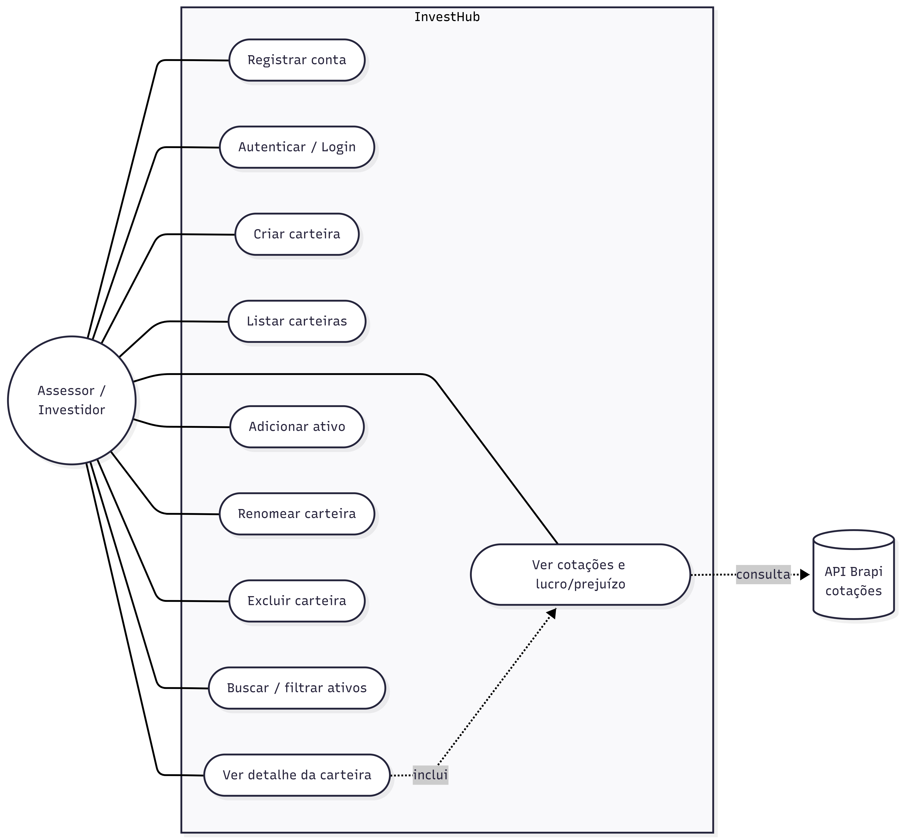

# Especificações do Projeto

# Personas

*Persona 1 – Ricardo Almeida*

Idade: 38 anos
Profissão: Assessor de Investimentos (AAI)
Localização: São Paulo – SP
Formação: Ensino Superior completo em Administração, com certificação para assessoria de investimentos
Objetivo: Acompanhar de forma consolidada e atualizada as carteiras de todos os seus clientes.

Descrição:
Ricardo atua há mais de 10 anos no mercado financeiro e hoje gerencia dezenas de carteiras de clientes com perfis distintos. Possui alta familiaridade com tecnologia e com os conceitos de mercado. No dia a dia, precisa consolidar dados de diferentes fontes para entender a composição e o desempenho de cada carteira antes de falar com o cliente.

Dores:
Ricardo perde muito tempo atualizando planilhas manualmente e conferindo cotações em diferentes sites. O cálculo de lucro/prejuízo é trabalhoso e sujeito a erro, e ele não tem uma visão consolidada e visual que possa mostrar rapidamente ao cliente.

Expectativas:
Ricardo espera uma aplicação que centralize as carteiras, calcule automaticamente o desempenho de cada ativo e apresente a alocação e o patrimônio de forma clara, com cotações atualizadas em que possa confiar.

*Persona 2 – Beatriz Costa*

Idade: 27 anos
Profissão: Analista de marketing
Localização: Belo Horizonte – MG
Formação: Ensino Superior completo
Objetivo: Começar a investir e entender, de forma simples, quanto tem investido e como está rendendo.

Descrição:
Beatriz começou a investir há pouco tempo e ainda está se familiarizando com conceitos como preço médio e rentabilidade. Possui poucos ativos e usa o celular e o computador com naturalidade, mas se sente insegura diante de ferramentas complexas voltadas a profissionais do mercado.

Dores:
Beatriz acha confuso acompanhar seus investimentos em diferentes aplicativos das corretoras e não consegue ter uma visão única do que possui. Tem receio de tomar decisões erradas por não entender se está tendo lucro ou prejuízo.

Expectativas:
Espera uma interface clara e intuitiva, que mostre de forma visual o valor total da carteira, o desempenho de cada ativo e a divisão entre as classes, ajudando-a a aprender enquanto acompanha seus investimentos.

*Persona 3 – Fernando Tavares*

Idade: 45 anos
Profissão: Engenheiro
Localização: Curitiba – PR
Formação: Ensino Superior completo
Objetivo: Acompanhar de perto sua carteira diversificada de ações e fundos imobiliários.

Descrição:
Fernando investe há vários anos e mantém uma carteira diversificada, com forte presença de FIIs e ações. É um investidor experiente, acompanha cotações diariamente e gosta de analisar a alocação do seu patrimônio entre as diferentes classes de ativos. Tem alta familiaridade com tecnologia.

Dores:
Fernando sente falta de uma ferramenta que reúna ações, FIIs e renda fixa em uma única visão consolidada, com cotações atualizadas e indicadores de desempenho por ativo. As soluções que usa são fragmentadas e nem sempre precisas.

Expectativas:
Espera precisão nas informações, cotações atualizadas, indicadores de lucro/prejuízo por ativo e um gráfico de alocação por classe que o ajude a equilibrar a carteira.

*Persona 4 – Camila Nogueira*

Idade: 31 anos
Profissão: Planejadora financeira / Assessora de Investimentos júnior
Localização: Florianópolis – SC
Formação: Ensino Superior completo em Economia
Objetivo: Organizar as carteiras dos primeiros clientes e demonstrar resultados com transparência.

Descrição:
Camila iniciou recentemente a carreira como assessora e está montando sua base de clientes. Domina os conceitos de mercado, mas ainda está estruturando seus processos de acompanhamento. Valoriza ferramentas que transmitam profissionalismo e organização ao cliente.

Dores:
Camila precisa de uma forma confiável e organizada de apresentar a composição e o desempenho das carteiras, mas ainda depende de planilhas que considera pouco profissionais e difíceis de manter atualizadas.

Expectativas:
Espera uma plataforma que permita criar e manter carteiras com agilidade, com cálculo automático de desempenho e uma visão consolidada que reforce a confiança do cliente em seu trabalho.

*Persona 5 – Marcos Pereira*

Idade: 52 anos
Profissão: Empresário
Localização: Recife – PE
Formação: Ensino Superior completo
Objetivo: Migrar o controle dos investimentos da planilha para uma ferramenta centralizada.

Descrição:
Marcos acumulou ao longo dos anos uma carteira relevante, controlada em uma planilha que ele mesmo mantém. Tem familiaridade tecnológica intermediária e quer reduzir o esforço manual e o risco de erro no acompanhamento do patrimônio.

Dores:
Marcos perde tempo atualizando preços manualmente e teme errar cálculos. A planilha não oferece uma visão visual da alocação nem cotações automáticas.

Expectativas:
Espera uma aplicação que importe o conceito da sua planilha, mas automatize as cotações e os cálculos, oferecendo uma visão consolidada e confiável do seu patrimônio.

# Histórias de Usuários

Com base na análise das personas, foram identificadas as seguintes histórias de usuários. Elas foram organizadas por contexto, de forma a facilitar a compreensão dos requisitos funcionais e não funcionais relacionados à aplicação.

## Gestão de Carteiras e Ativos (Assessores e Investidores)

| EU COMO... `PERSONA` | QUERO/PRECISO ... `FUNCIONALIDADE`                            | PARA ... `MOTIVO/VALOR`                                          |
| -------------------- | ------------------------------------------------------------- | ---------------------------------------------------------------- |
| Ricardo (Assessor)   | Criar uma carteira de investimentos para cada cliente         | Organizar separadamente o patrimônio de cada cliente             |
| Ricardo (Assessor)   | Adicionar ativos a uma carteira (ticker, tipo, quantidade, preço médio) | Registrar a composição real da carteira do cliente      |
| Camila (Assessora)   | Renomear uma carteira                                         | Manter a organização das carteiras conforme a base cresce        |
| Camila (Assessora)   | Excluir uma carteira que não é mais necessária                | Manter apenas carteiras ativas e relevantes                      |
| Marcos (Investidor)  | Migrar o controle da minha planilha para carteiras na aplicação | Reduzir esforço manual e risco de erro no acompanhamento       |
| Beatriz (Iniciante)  | Cadastrar meus poucos ativos de forma simples e validada      | Começar a acompanhar meus investimentos sem errar os dados       |

## Acompanhamento e Análise (Investidores e Assessores)

| EU COMO... `PERSONA`            | QUERO/PRECISO ... `FUNCIONALIDADE`                                    | PARA ... `MOTIVO/VALOR`                                            |
| ------------------------------- | --------------------------------------------------------------------- | ------------------------------------------------------------------ |
| Beatriz (Iniciante)             | Visualizar o valor total e o lucro/prejuízo da minha carteira         | Entender de forma simples como meus investimentos estão rendendo   |
| Fernando (Investidor avançado)  | Ver as cotações reais e atualizadas dos meus ativos                   | Tomar decisões baseadas em dados de mercado confiáveis             |
| Fernando (Investidor avançado)  | Visualizar a alocação por classe de ativo em um gráfico              | Equilibrar minha carteira entre ações, FIIs e renda fixa           |
| Fernando (Investidor avançado)  | Buscar e filtrar ativos dentro da carteira por código e por tipo      | Localizar rapidamente um ativo específico em carteiras grandes     |
| Ricardo (Assessor)              | Acompanhar o patrimônio consolidado no dashboard                      | Ter uma visão geral rápida para conversar com o cliente            |
| Ricardo (Assessor)              | Listar as carteiras de forma paginada                                 | Navegar com agilidade mesmo com muitos clientes cadastrados        |
| Beatriz (Iniciante)             | Acessar a aplicação com login e senha seguros                         | Garantir que apenas eu tenha acesso aos meus dados financeiros     |

# Requisitos

As tabelas que se seguem apresentam os requisitos funcionais e não funcionais que detalham o escopo do projeto.

### Requisitos Funcionais

|ID    | Descrição do Requisito  | Prioridade |
|------|-------------------------|----|
|RF-001| A aplicação deve permitir o **cadastro de usuário** (nome, e-mail, senha). | ALTA |
|RF-002| A aplicação deve permitir a **autenticação** do usuário (login/logout) com **JWT**. | ALTA |
|RF-003| A aplicação deve permitir **criar uma carteira de investimentos**. | ALTA |
|RF-004| A aplicação deve permitir **listar as carteiras do usuário** de forma **paginada**. | ALTA |
|RF-005| A aplicação deve permitir **visualizar o detalhe de uma carteira**: ativos, cotações atuais, lucro/prejuízo e valor total. | ALTA |
|RF-006| A aplicação deve permitir **adicionar um ativo à carteira** (ticker, tipo, quantidade, preço médio), com **validação** (quantidade > 0, preço > 0, ticker em formato correto). | ALTA |
|RF-007| A aplicação deve permitir **renomear uma carteira** (PATCH). | MÉDIA |
|RF-008| A aplicação deve permitir **excluir uma carteira** (DELETE), com **confirmação** e **remoção em cascata** dos ativos. | MÉDIA |
|RF-009| A aplicação deve permitir **buscar e filtrar ativos** dentro da carteira (por código e por tipo). | MÉDIA |
|RF-010| A aplicação deve permitir **visualizar a alocação por classe de ativo** (gráfico) e o **patrimônio consolidado** no dashboard. | ALTA |
|RF-011| A aplicação deve realizar a **integração com cotações reais de mercado** via API Brapi, com **cache**. | ALTA |
|RF-012| A aplicação deve aplicar **autorização por posse**, garantindo que o usuário só acesse e manipule **suas próprias carteiras**. | ALTA |

# Requisitos não Funcionais

|ID     | Descrição do Requisito  | Prioridade |
|-------|-------------------------|----|
|RNF-001| A aplicação deve ser **responsiva** e funcionar nos principais navegadores modernos. | ALTA |
|RNF-002| **Validação de dados**: as entradas devem ser validadas com **Zod** (formato de ticker, valores numéricos, e-mail, etc.). | ALTA |
|RNF-003| **Segurança**: senhas com **bcrypt**, autenticação via **JWT**, **HTTPS** em produção e **autorização por posse** (defesa em profundidade). | ALTA |
|RNF-004| **Performance**: uso de **cache de cotações** (Redis) e **paginação** nos endpoints de lista. | ALTA |
|RNF-005| **Observabilidade**: a aplicação deve gerar **logs estruturados** em JSON (Pino). | MÉDIA |
|RNF-006| **Qualidade**: **testes automatizados** com cobertura mínima (linhas 80%, funções 70%). | MÉDIA |
|RNF-007| **Escalabilidade**: arquitetura **stateless** (JWT sem sessão, cache externo no Redis), permitindo escala horizontal. | MÉDIA |

Com base nas Histórias de Usuário, enumere os requisitos da sua solução. Classifique esses requisitos em dois grupos:

# Restrições

O projeto está restrito pelos itens apresentados na tabela a seguir.

## Restrições de Gestão

|ID| Restrição de Gestão                                           |
|--|-------------------------------------------------------|
|RNF-000| O sistema deve ser entregue até novembro|
|RNF-000| O desenvolvimento não pode superar X custo|
|RF-000| A equipe não pode ter mais de 7 pessoas|

## Restrições de Negócios

|ID| Restrição de Negócios                                           |
|--|-------------------------------------------------------|
|RNF-000| Valores monetários devem ser tratados com precisão decimal (Decimal), nunca com ponto flutuante|
|RF-000| Quantidade de um ativo deve ser maior que zero e preço médio maior que zero|
|RF-000| O ticker do ativo deve respeitar o formato válido de negociação na B3|
|RF-000| As cotações dependem da disponibilidade da API pública Brapi (dados da B3)|
|RF-000| Cada usuário só pode acessar e manipular as carteiras de sua própria posse|

# Diagrama de Casos de Uso

O diagrama de casos de uso é o próximo passo após a elicitação de requisitos, que utiliza um modelo gráfico e uma tabela com as descrições sucintas dos casos de uso e dos atores. Ele contempla a fronteira do sistema e o detalhamento dos requisitos funcionais com a indicação dos atores, casos de uso e seus relacionamentos. 

As referências abaixo irão auxiliá-lo na geração do artefato “Diagrama de Casos de Uso”.

> **Links Úteis**:
> - [Criando Casos de Uso](https://www.ibm.com/docs/pt-br/elm/6.0?topic=requirements-creating-use-cases)
> - [Como Criar Diagrama de Caso de Uso: Tutorial Passo a Passo](https://gitmind.com/pt/fazer-diagrama-de-caso-uso.html/)
> - [Lucidchart](https://www.lucidchart.com/)
> - [Astah](https://astah.net/)
> - [Diagrams](https://app.diagrams.net/)

;
